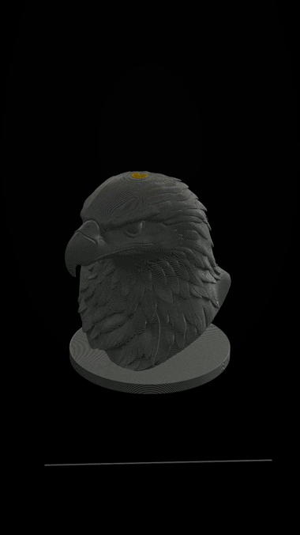

# SkipFrame

Turn a slicer's G-code into a layer-by-layer print animation and export it as a vertical video
for Reels and Shorts.

Your G-code never leaves the machine: parsing, rendering and encoding all happen locally, with
no account and no telemetry. The one thing that is ever uploaded is a finished video you choose
to share to a StepperSkip company profile — that needs a StepperSkip account, and nothing else in
the app does. MIT licensed.

> **Status: in progress.** The parser, the renderer, the studio, the export pipeline, the batch
> queue and the settings screen work end to end on Windows, on real files from OrcaSlicer,
> BambuStudio and PrusaSlicer, single- and multi-material. Sharing to StepperSkip works against
> production at `https://www.stepperskip.com`: release builds point there, and debug builds use a
> local development install unless `SKIPFRAME_STEPPERSKIP_URL` says otherwise.
>
> Development happens on Windows. macOS testing (Apple Silicon) is under way. MP4 export works
> there now, but only in H.264 Baseline: WKWebView accepts High and Main and then never returns
> a frame, so the encoder is picked by a trial encode rather than by `isConfigSupported` (see
> [`src/export/h264.ts`](src/export/h264.ts)). WKWebView also labels its limited-range output as
> full range, which made players show it washed out; the MP4 now carries the range the stream
> actually has, the same `tv` / BT.709 a Windows export does. Not yet confirmed on macOS: the
> Keychain token store and the unsigned-build first launch. Also outstanding: the external-FFmpeg
> outputs are detected but not wired up.

The interface is Turkish. The Rust crate, the CLI and the code are English; see
[Language](#language).



---

## Why it is built this way

| Decision                                                         | Reason                                                                                                                                                                                                                                         |
| ---------------------------------------------------------------- | ---------------------------------------------------------------------------------------------------------------------------------------------------------------------------------------------------------------------------------------------- |
| G-code is parsed in Rust, streaming                              | A 750 000-path file has to be read in under two seconds and must not block the UI thread. There is no file-size limit.                                                                                                                         |
| The parser answers with raw bytes, not JSON                      | `tauri::ipc::Response::new(Vec<u8>)` arrives in the WebView as an `ArrayBuffer` that becomes TypedArray views with no copy. JSON would be an order of magnitude larger and slower than the parse itself.                                       |
| One instanced geometry, animated with `instanceCount`            | One draw call for the whole print. Per-layer meshes would cost hundreds of draw calls and lose the 60 fps scrub. The print is drawn as extrusion beads — one prism, uploaded once, drawn once per segment — so light has a surface to fall on. |
| The animation is driven by frame index, never by wall-clock time | Export has to be deterministic: the same file must produce the same video, frame for frame.                                                                                                                                                    |
| Export uses `WebCodecs` plus an MIT MP4 muxer                    | The operating system's own H.264 encoder does the work. No codec binary is bundled and no licence obligation is taken on.                                                                                                                      |
| No FFmpeg is shipped                                             | Advanced output (ProRes, CRF, alpha) is unlocked only if the user already has FFmpeg on `PATH` or points at one.                                                                                                                               |

Linux is out of scope, which is what makes the WebCodecs route sufficient: WebView2 (Chromium) on
Windows and WKWebView (Safari 16.4+) on macOS both provide `VideoEncoder`.

---

## Layout

```
crates/skipframe-gcode/   parser, IR, dialects, printer profiles, container handling
  src/ir.rs                 the SFIR binary format — the one file to read first
  src/parse.rs              layer 1 (motion) and layer 2 (semantics), one streaming pass
  src/dialect.rs            slicer detection and comment vocabulary
  src/container.rs          .gcode, .gcode.3mf, and the slot for .bgcode
  src/profile.rs            printer bed profiles
  src/bin/sf_gcode.rs       CLI: parse, plates, synth — used for benchmarking

src-tauri/                desktop shell: IPC commands, parse cache, updater config
  src/stepperskip/          StepperSkip sign-in, tokens, resumable upload and publishing
src/                      Vue 3 front end
  ir/                       TypedArray views over the parser's buffer
  render/                   the print scene: bead geometry, lighting, camera
  export/                   the render loop, the two sinks, the raw-byte file write
  stores/                   scene, project, export job, queue, notices — plain reactive modules
  screens/                  empty state, studio, queue, settings
  queue/                    the queue's own renderer and its bridge to the folder watcher
  components/ui/            the design's component sheet, one file each
  lib/messages.ts           the one file that turns a parser code into Turkish
  styles/tokens.css         every colour and spacing value in the app
  bench/                    phase-0 harness and development-only fixtures
```

---

## The intermediate representation

One flat little-endian buffer, produced by Rust, consumed by JavaScript, cached on disk
unchanged. The authoritative description is in
[`crates/skipframe-gcode/src/ir.rs`](crates/skipframe-gcode/src/ir.rs).

| Array         | Type           | Granularity               | Meaning                                                                                  |
| ------------- | -------------- | ------------------------- | ---------------------------------------------------------------------------------------- |
| `positions`   | `Float32Array` | per vertex, 2 per segment | `x, y, z` of the segment start then its end, millimetres, Z up                           |
| `layerStart`  | `Uint32Array`  | per layer + 1             | segment offset where each layer begins; trailing sentinel is the segment count           |
| `featureType` | `Uint8Array`   | per segment               | travel, outer/inner wall, solid/sparse infill, support, skirt, bridge, top               |
| `toolIndex`   | `Uint8Array`   | per segment               | extruder, for multi-material prints                                                      |
| `width`       | `Float32Array` | per segment               | extrusion width, millimetres                                                             |
| `meta`        | JSON           | whole file                | slicer, printer, bed, layer count, layer Z list, estimated time, filament, warning codes |

`width` drives the thickness of every bead the renderer draws, and `toolIndex` picks its colour
on a multi-material print — the studio shows one colour row per extruder when a file uses more
than one, and a single swatch when it does not. Every one of these arrays reaches the GPU as a
view onto the parser's buffer, with no copy.

Positions are stored per vertex so the pair of endpoints for each segment is contiguous: the
renderer binds them as two interleaved instance attributes over the same buffer, with no copy.
`width` and `featureType` are bound the same way, which is why the bead geometry adds nothing to
what the GPU already holds.

---

## Colour

A print can be painted two ways, and only one can be in effect at a time — so the studio makes
it a choice rather than a switch with a hidden consequence.

**By filament** is what the print will look like. Every path takes the colour of the extruder
that laid it. A single-material file gets one swatch; a multi-material file gets one row per
extruder, because `meta.toolCount` says how many the file actually used.

**By feature** is what the slicer decided. Filament colour stops applying and each path is
coloured by its job instead — outer wall, inner wall, solid and sparse infill, support, brim,
bridge, top surface. The legend lists only the features present in the open file, so it is as
long as the print is complicated. This is the mode for reading a file before printing it: where
the support went, whether the top is solid, whether an overhang was bridged or propped.

Both palettes live in a 16x1 `DataTexture`, so changing a colour costs a 64-byte upload rather
than rewriting tens of megabytes of vertex attributes. Neither mode touches the geometry.

---

## Slicer support

The parser is split in two so that a file from an unknown slicer still produces a video.

**Layer 1 — geometry.** `G0/G1/G2/G3`, `X/Y/Z/E/F`, absolute and relative extrusion, `G90/G91`,
`M82/M83`, `G92`, `G20/G21`, tool changes. Comment-independent, correct everywhere.

**Layer 2 — semantics.** Layer boundaries, feature types, extrusion width, printer identity.
Dialect-specific; when a marker is missing it degrades and records a warning instead of failing.

| Slicer         | Detected by                       | Layer marker     | Feature marker             |
| -------------- | --------------------------------- | ---------------- | -------------------------- |
| PrusaSlicer    | `generated by PrusaSlicer`        | `;LAYER_CHANGE`  | `;TYPE:External perimeter` |
| OrcaSlicer     | `generated by OrcaSlicer`         | `;LAYER_CHANGE`  | `;TYPE:`                   |
| Bambu Studio   | `generated by BambuStudio`        | `; CHANGE_LAYER` | `; FEATURE: Outer wall`    |
| Cura           | `Generated with Cura_SteamEngine` | `;LAYER:n`       | `;TYPE:WALL-OUTER`         |
| Creality Print | Cura derivative                   | `;LAYER:n`       | `;TYPE:`                   |

Cura and Creality Print do not emit `;WIDTH:`, so width is computed from the E delta, the
filament cross-section and the layer height.

Containers: `.gcode` is streamed; `.gcode.3mf` has `Metadata/plate_N.gcode` extracted from the
zip. `.bgcode` is recognised and refused with a clear message — the container layer is abstracted
so it can be added in one file.

---

## Export

Two outputs, and the difference between them is deliberate.

**MP4 · H.264.** `VideoEncoder` hands frames to the operating system's own encoder and
[`mp4-muxer`](https://github.com/Vanilagy/mp4-muxer) (MIT) wraps them. Frames are taken straight
off the render canvas with `new VideoFrame(canvas, { timestamp })` — no `readPixels`, no IPC per
frame. The codec level follows the resolution, so a 2x render scale still finds a configuration
the encoder accepts. Nothing is bundled and no licence is taken on.

**PNG frame sequence.** Needs no codec at all, so it works on any machine and is the fallback
whenever the H.264 path is unavailable — and it is what an editor wants anyway.

The finished file crosses to Rust as the request's raw body, so a hundred-megabyte video is bytes
rather than a JSON array of numbers, and it is written to exactly the path the save dialog
returned.

Export walks the frame index one step at a time with no clock involved, using the same
`layerForFrame` and `viewForFrame` the preview does — so the camera move, the easing and the
holds at either end are baked into the file exactly as they looked in the studio. Two separate runs of the same export produce
bit-identical decoded frames; see [docs/phase-0.md](docs/phase-0.md).

**In batches.** The queue renders a list of files one after another with one scene applied to
all of them, into a renderer of its own — so walking back to the studio mid-run does not stop
it, and the studio's own viewport is never disturbed. A file is read once when it is queued, to
fill in its row, and again when it is rendered, which is a parse-cache hit; holding every job's
intermediate representation in memory from the moment it was queued would cost tens of megabytes
a row.

External FFmpeg for ProRes, CRF and alpha is not wired up yet. Nothing will ever be bundled: if
it is on `PATH` or the user points at one, those options appear.

---

## Settings

Preferences live in one JSON file in the app's config directory. Every field is optional or has
a default, so a file written by an older build still loads.

**The watched folder** is the one with moving parts. Point it at a slicer's output directory and
new G-code is queued and rendered as it appears. It polls every two seconds rather than using an
OS file-notification API, on purpose: a slicer writes a file over hundreds of milliseconds, so a
"file created" notification arrives long before the file is worth reading, and every
notification-based implementation ends up adding exactly the settling logic polling gives away
for free. A file is offered only once its size has stopped changing.

**External FFmpeg** is detected, never installed and never bundled — the settings screen reports
whether one is on `PATH` (or at a path the user chose) and what version it is. The outputs that
unlocks are not written yet.

**The parse cache** is keyed by the file's content hash, so the same bytes under two names share
an entry and re-opening a file costs a read rather than a parse. The screen shows what it holds
and empties it.

---

## Sharing to StepperSkip

A finished MP4 can be published to a [StepperSkip](https://stepperskip.com) company profile
from the export panel. It is the only thing in SkipFrame that talks to a server, it happens only
when the user presses the button, and G-code is never part of it.

**Signing in** uses OAuth 2.0 authorization code with PKCE in the system browser, returning to a
one-request listener on `127.0.0.1`. SkipFrame is an open-source public client, so there is no
client secret, and it never sees the password. The refresh token lives in the operating system's
credential store — Windows Credential Manager, the macOS Keychain — and the access token only in
memory. StepperSkip rotates refresh tokens and revokes the whole family when an old one is
presented, so a refresh happens once however many requests need a token.

**Uploading** sends strictly sequential chunks of at most 5 MiB and, after any failure, continues
from the offset the server reports rather than from what the client believes it sent. The file is
hashed first, and nothing is published unless the SHA-256 StepperSkip computes matches. Sharing
the same file again continues an unfinished upload instead of opening a new session.

**Before anything is sent**, the share screen checks what StepperSkip will check: an MP4, within
the size and duration from `/api/v1/limits`, a title, and an active company profile. Whether a
user may share at all is StepperSkip's decision; the screen explains it and does not re-implement
it.

The server is chosen at build time with `SKIPFRAME_STEPPERSKIP_URL`. A debug build defaults to a
local development install; a release build with no URL has no sharing at all.

## When something goes wrong

Failures are reported wherever the user is standing, not only on the screen that produced them.
A batch job that fails while the studio is open, a watched folder that cannot write, a
preferences file that will not save — each raises a notice in one global stack. Errors and
warnings stay until they are dismissed; only plain information leaves on its own. A repeat
increments a counter rather than stacking, because a watched folder that cannot write fails
once per file that lands in it.

Non-fatal parser degradations are separate: they travel in `meta.warnings`, the file still
renders, and the studio's info rail lists them.

## Language

The interface is Turkish. The Rust crate is English, because it is an MIT library with a CLI and
that is the right language for both.

So nothing translates prose across that boundary. `Error::code` and `Warning::code` are stable
identifiers — `no_moves`, `archive`, `unknown_dialect` — and they are what crosses the IPC, with
the English message alongside. [`src/lib/messages.ts`](src/lib/messages.ts) is the only file that
turns one into something a user reads, and the only file a second language would need. Every
lookup falls back to the English that came with it, which is what keeps an unrecognised code —
a cache entry written by an older build, say — readable rather than cryptic.

One exception: `io` failures keep the operating system's own message. Windows tells "not found"
apart from "access denied" and writes both in the user's language already.

---

## Development

```bash
npm install
npm run app:dev      # Tauri dev build
npm run lint         # ESLint
npm run typecheck    # vue-tsc
npm run format:check # Prettier
cargo test --workspace
cargo clippy --workspace --all-targets -- -D warnings
cargo fmt --all --check
```

The studio can also be worked on in a plain browser tab, with no desktop shell and no fixture:
`npm run dev`, then `http://localhost:1420/#preview` opens it against a synthetic four-extruder
model. Anything that needs the parser or the filesystem is absent there by definition.

Phase-0 measurements — parse speed, render speed, WebCodecs encoding — and how to re-take them
are in [docs/phase-0.md](docs/phase-0.md). The harness runs inside the app:

```bash
VITE_BENCH=1 VITE_BENCH_FILE=/abs/path/to/file.gcode npx tauri dev --release
```

or in a plain browser tab at `http://localhost:1420/#bench`, where it falls back to a synthetic
model and needs no fixture. That second form is how the macOS WebCodecs answer gets taken.

The parser can be exercised without the app:

```bash
cargo run --release -p skipframe-gcode --bin sf-gcode -- parse path/to/file.gcode --repeat 5
cargo run --release -p skipframe-gcode --bin sf-gcode -- plates path/to/file.gcode.3mf
cargo run --release -p skipframe-gcode --bin sf-gcode -- synth big.gcode --layers 570 --per-layer 1316
```

`synth` writes a benchmark file rather than shipping a hundred megabytes of fixtures in the
repository; `--dialect`, `--feature-every` and `--retract-every` shape what it produces.

---

## Releases and updates

Builds are produced by GitHub Actions for Windows x64 and macOS (Apple Silicon and Intel) and
published to GitHub Releases. They are **not** code signed, so the first launch needs
"Run anyway" on Windows and a quarantine removal on macOS.

The Tauri updater is configured from day one so that the first install is the only friction a
user meets. Its minisign key pair is unrelated to OS code signing: it only lets an installed copy
verify that an update really came from this repository.

Release secrets, set once on the repository:

- `TAURI_SIGNING_PRIVATE_KEY` — contents of the private key file
- `TAURI_SIGNING_PRIVATE_KEY_PASSWORD` — empty if the key has no password

The public half lives in `src-tauri/tauri.conf.json`. The private half must never be committed;
`.keys/` is ignored by git.

---

## Licence

MIT. See [LICENSE](LICENSE).
