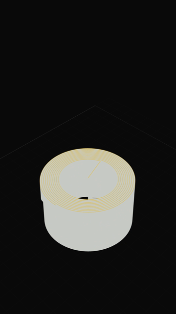
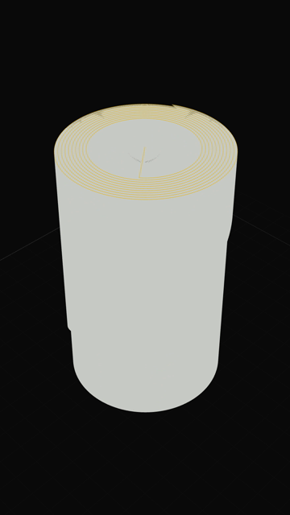

# Phase 0 — the three risks

Nothing is built on top of these until they pass. Each one is a measurement, not an opinion.

Re-run everything with:

```bash
cargo run --release -p skipframe-gcode --bin sf-gcode -- parse fixtures/bench-prusa.gcode --repeat 5
VITE_BENCH=1 VITE_BENCH_FILE=/abs/path/to/fixtures/bench-prusa.gcode npx tauri dev --release
```

The second command opens the app straight into `src/bench/BenchApp.vue`, which runs risks (b)
and (c) and prints every line to the terminal through the `bench_log` command. The same harness
runs in a plain browser tab at `http://localhost:1420/#bench`, where it falls back to a
synthetic IR so it needs no fixture.

## The test files

### A real one

`erglagalvabamboo_ABS_3h45m.gcode` — OrcaSlicer 2.4.2, Flashforge Adventurer 5M Pro, ABS,
**24.2 MB, 568 layers, 785 067 segments** of which 753 874 extrude. It is not committed: it is
someone's model, and the repository has no business carrying it.

Finding the numbers was only half of what this file was worth. Running it turned up three real
defects that the generated fixture could not have:

1. **The layer count was 570, and the file's own header said 568.** Everything a slicer emits
   before its first `;LAYER_CHANGE` — the prime, the purge line, the wipe — was being counted as
   one or two layers of its own. That start-block geometry is real and stays in the IR, but it is
   now folded into the first marked layer, so our count matches the slicer's.
2. **Print time came out as 14 seconds instead of 3h 44m 46s.** Orca writes
   `estimated first layer printing time` immediately after the total, and the second line was
   overwriting the first.
3. **The bounding box was the bed, not the model.** The purge line runs the full width of the
   plate along the front edge, so the reported size was `110 x 160` instead of `94 x 100`, and
   the camera would have framed the bed edge. The start block no longer contributes to the box.

Each of those has a regression test now.

### A generated one

The real file arrived after the first round of measurements, which used a fixture built to the
same shape:

```bash
cargo run --release -p skipframe-gcode --bin sf-gcode -- \
  synth fixtures/bench-prusa.gcode --layers 570 --per-layer 1316 --dialect prusa
```

570 layers x 1316 paths = **750 120 extrusion paths, 25.6 MB**, with a real PrusaSlicer banner,
config block, `;LAYER_CHANGE` / `;Z:` / `;TYPE:` / `;WIDTH:` markers and a layer-change travel.
`--dialect cura|bambu|orca`, `--feature-every` and `--retract-every` produce the other shapes.

**This is synthetic.** It exercises every code path the parser has, but it is more regular than a
real slicer's output. The stress variants below exist to close some of that gap, and the numbers
should be re-taken against a real file before the parser is considered finished.

---

## (a) Parse — must be under 2 s

Measured on the release binary, best of 5 runs, Windows 11, Ryzen-class laptop, NVMe.

| File                                                    |     Paths |           Size |       Parse | Encode to IR | Throughput |
| ------------------------------------------------------- | --------: | -------------: | ----------: | -----------: | ---------: |
| PrusaSlicer                                             |   750 120 |        25.6 MB | **59.2 ms** |       6.7 ms |   433 MB/s |
| Cura (width derived from E)                             |   750 120 |        25.6 MB |     58.4 ms |       4.3 ms |   438 MB/s |
| Bambu Studio                                            |   750 120 |        25.6 MB |     57.6 ms |       4.4 ms |   445 MB/s |
| OrcaSlicer                                              |   750 120 |        25.6 MB |     57.4 ms |       4.7 ms |   447 MB/s |
| Stress: feature marker every 20 paths, retract every 40 |   750 120 |        27.8 MB |     66.0 ms |       4.9 ms |   421 MB/s |
| Scale: 2000 layers                                      | 3 000 000 |       107.2 MB |    245.5 ms |      17.3 ms |   437 MB/s |
| `.gcode.3mf`, plate 1 of 2 (includes inflate)           |   750 120 | 17.9 MB zipped |     96.1 ms |            — |          — |
| **Real: OrcaSlicer 2.4.2, ABS, Flashforge 5M Pro**      |   785 067 |        24.2 MB | **68.4 ms** |       4.2 ms |   353 MB/s |

SHA-256 for the cache key costs 13.5 ms on the 25.6 MB file and 54 ms on the 107 MB one.

**Verdict: pass, by roughly 30x.** Throughput is flat from 25 MB to 107 MB, so the streaming
design holds and there is no file-size limit to defend. The real file lands 4 % slower per byte
than the generated one, which is the cost of its denser comments and its arcs.

On the real file the parser recovers: OrcaSlicer 2.4.2, 568 layers matching the header exactly,
3h 44m 46s, 89.78 g of filament, and a 220 x 220 bed with its origin at -110,-110 read from
`bed_shape` — the Flashforge Adventurer 5M Pro is not in our profile table, and the bed_shape
fallback produced the right plate anyway, which is the behaviour that fallback exists for.

Correctness checks that came free with the measurement: 570 layers found, 750 120 extruding
segments plus exactly one travel per layer, Z range 0.2–114.0 mm, printer resolved from
`printer_model = MK4IS` to the Prusa MK4 profile, bed read from `bed_shape`. In the stress file
the retract / travel / prime triplets produced exactly one travel segment each.

### The IPC round trip

Parsing is only part of what the user waits for. Full round trip from the front end —
hash, parse, encode, write cache, hand 22.5 MB across IPC, wrap in TypedArrays:

| Build                                       |     Round trip |
| ------------------------------------------- | -------------: |
| `tauri dev --release`, real file            | **292–294 ms** |
| `tauri dev --release`, generated file       |         247 ms |
| `tauri dev` (debug shell, optimised parser) |    843–1070 ms |

The parser is compiled at `opt-level = 3` even in dev builds, so the gap between the two rows is
the unoptimised shell and IPC layer, not parsing. 247 ms is what a user actually waits for on a
cold open of a 750 000-path file, cache miss included.

---

## (b) Render — must hold 60 fps while scrubbing

568 frames, one per layer, sweeping the whole real print. Canvas 1080x1920 at pixel ratio 1 —
the export resolution, which is heavier than the on-screen viewport. Travels hidden. Measured
inside the app's WebView2.

| Metric                                       | Value                                         |
| -------------------------------------------- | --------------------------------------------- |
| Frame interval                               | p50 **4.20 ms**, p95 4.40 ms, max 5.50 ms     |
| Frames within a 60 Hz budget                 | 100 %                                         |
| Mean rate                                    | ~240 fps                                      |
| `renderer.render()` CPU cost                 | p50 0.10 ms, p95 0.20 ms                      |
| GPU time (`EXT_disjoint_timer_query_webgl2`) | p50 0.55 ms, p95 1.11 ms                      |
| Draw calls per frame                         | 3 (print, bed grid, bed outline)              |
| Context                                      | WebGL2, ANGLE / D3D11, NVIDIA RTX 5060 Laptop |

The real file also found two defects in the renderer that a centred model on a corner-origin bed
would never have shown:

- **The print stood in a corner of its own plate.** The Flashforge puts 0,0 at the middle of the
  bed and reports `bed_origin = -110,-110`. The renderer was assuming a front-left origin.
- **The print did not fit the 9:16 frame.** Framing was computed from the vertical field of
  view, but on a portrait canvas the horizontal one is far narrower and is what actually binds.
  The camera now fits the print's bounding sphere against whichever field of view is tighter,
  and re-fits when the aspect ratio changes.

**Verdict: pass, by roughly 4x on the GPU and far more on the CPU.**

What makes it cheap: one merged `LineSegments` geometry, animated only by `setDrawRange`. The
position array is the parser's buffer with no copy. Feature colour is one `Uint8` attribute per
vertex (1.5 MB) sampled against a 16x1 palette texture, so recolouring costs a 64-byte upload
instead of rewriting the vertex buffer. Travels are hidden by collapsing them outside the clip
volume in the vertex shader rather than by splitting the geometry into a second draw call.

The measurement was taken on a discrete GPU. Integrated graphics will be slower, and the
headroom above is the argument that it will still clear 60 fps — but that is an inference, not a
measurement.

---

## (c) WebCodecs H.264 — the one that decides the export architecture

180 frames of 1080x1920 at 60 fps, taken straight off the render canvas with
`new VideoFrame(canvas, { timestamp })` — no `readPixels`, no IPC — encoded with `VideoEncoder`
and muxed with `mp4-muxer`.

### Windows (WebView2 / Chromium)

| Probe                                         | Result    |
| --------------------------------------------- | --------- |
| `VideoEncoder` present                        | yes       |
| `avc1.64002a` (High 4.2), `prefer-hardware`   | supported |
| `avc1.64002a` (High 4.2), `no-preference`     | supported |
| `avc1.4d002a` (Main 4.2), `prefer-hardware`   | supported |
| `avc1.42002a` (Baseline 4.2), `no-preference` | supported |

| Metric      | Value                                   |
| ----------- | --------------------------------------- |
| Encode rate | **262 fps** (render + capture + encode) |
| 180 frames  | 0.69 s                                  |
| Muxing      | 7 ms total                              |
| Output      | 4.77 MB, 2 keyframes                    |

The output was written to disk and read back with `ffprobe`, so "it produced bytes" is not
standing in for "it produced a video":

```
codec_name=h264   profile=High   level=42   pix_fmt=yuv420p
width=1080        height=1920    r_frame_rate=60/1
nb_frames=180     duration=2.983 bit_rate=12799845
```

Decoded frames 60 and 170 show the print at two different heights, with the printed material in
grey and the layer being laid down in gold — so the frame-index animation, the draw range and the
capture are all doing what they claim.

| frame 60                          | frame 170                          |
| --------------------------------- | ---------------------------------- |
|  |  |

A 30-second Reel is 1800 frames, so this is roughly **6.5 seconds of export for 30 seconds of
video**, with the renderer in the loop.

**Verdict on Windows: pass.**

### macOS (WKWebView / Safari)

**Not measured. There is no Mac in this environment.**

This is the risk the whole export design rests on, so it stays open until someone runs the
harness on macOS 13+:

```bash
npm install
VITE_BENCH=1 npx tauri dev --release
```

The relevant lines are the ones beginning `[bench] encode:` and `[bench]   probe`. What we need
to know, in order:

1. Is `VideoEncoder` defined at all?
2. Does any `avc1.*` configuration report `supported: true`?
3. Does a timed run produce a non-zero byte count without an error?
4. What encode rate does it reach?

Safari has shipped WebCodecs `VideoEncoder` since 16.4, and macOS 13 is our floor, so the
expectation is that it works. If it does not, plan B is a thin `objc2` binding to VideoToolbox on
the Rust side — still Apple's own encoder, still zero licence surface — and the frame-sequence
export (PNG / WebP) already covers the case where no codec is available at all.

---

---

## The export path, checked end to end

Both sinks were driven through the shipping code — `runExport`, the sink, the raw-body IPC
write — on the real file, at the export resolution:

| Output                  | Frames |   Time | Per frame |    Size |
| ----------------------- | -----: | -----: | --------: | ------: |
| MP4, 1080x1920 @ 30     |     90 | 0.45 s |    5.0 ms | 1.68 MB |
| PNG sequence, 1080x1920 |     12 | 0.22 s |     18 ms | 2.53 MB |

`ffprobe` on the MP4: `h264 / High / yuv420p / 1080x1920 / 30 fps / 90 frames`. The PNGs are
1080x1920 RGBA, numbered from one.

PNG costs about 3.5x more per frame than H.264 and roughly 15x more on disk, which is the trade
the format exists to make. A 12-second clip at 30 fps is 360 frames: about 2 seconds as MP4,
about 7 as a sequence.

The MP4 is muxed in memory before it is written, so a 90-second 1080p60 export holds roughly
160 MB while it finishes. That is fine for the vertical formats this is for; a multi-minute
timelapse would want a streaming target instead.

---

## Determinism, measured

The frame-index rule exists so that a rendered video is reproducible. That is now checked rather
than asserted: the same file was exported twice, in two separate runs of the app, and every
decoded frame compared.

```bash
ffmpeg -i run1.mp4 -f framemd5 run1.framemd5
ffmpeg -i run2.mp4 -f framemd5 run2.framemd5
diff <(grep -v '^#' run1.framemd5) <(grep -v '^#' run2.framemd5)
```

All 90 frames match bit for bit. The container's SHA-256 differs between the runs, because
`mp4-muxer` stamps a creation time into the movie header — metadata, not picture. If byte-identical
files are ever needed, that is the one field to pin.

---

## Decisions this confirms

- The IR format and the raw-byte IPC hold up: 22.5 MB crosses as an `ArrayBuffer` and becomes
  GPU buffers with one copy, for one attribute, once per file.
- `setDrawRange` on a single merged geometry is not a compromise; it is the reason the scrub is
  free.
- Driving the animation by frame index rather than wall-clock time costs nothing and is what
  lets the encoder run at 235 fps instead of being paced at 60.
- Nothing here needs FFmpeg, and nothing here needs a bundled codec.
